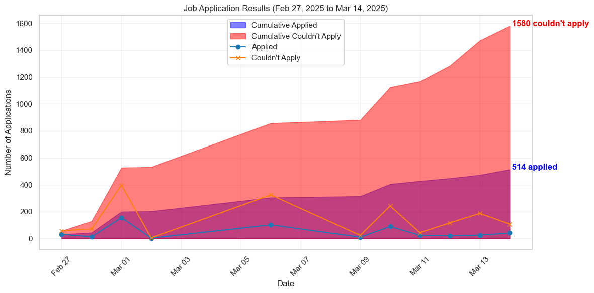

# LinkedIn Easy Apply Bot 🤖 

A python bot to automatically apply to LinkedIn Easy Apply jobs based on your preferences.

## Installation 🔌

### Quick Setup

1. Make sure you have Git, Python, and pip installed
   - For Windows: Download from [python.org](https://www.python.org/downloads/)
   - For Mac: `brew install python` (requires [Homebrew](https://brew.sh/))

2. Clone the repo
   ```
   git clone https://github.com/nranabhat/LinkedInJobBot
   ```

3. Install dependencies
   ```
   pip install -r requirements.txt
   ```

4. Create your config file
   ```
   # For Windows
   copy config_template.py config.py
   
   # For Mac
   cp config_template.py config.py
   ```

5. Edit `config.py` with your LinkedIn credentials and job search preferences

6. Run the bot
   ```
   python runner.py
   ```

## Features 💡

- Apply to jobs with a single click based on your preferences
- Filter by location, keywords, experience level, and more
- Blacklist companies or job titles you want to avoid
- Automatically handle single-page job applications
- Track your applications in a data file

### Application Analytics 📊
- Run `demographics.ipynb` to visualize your job application data
- See geographic distribution of your applications across states
- Track application volume over time
- Example visualization:
  

### Coming Soon! 🚀
- Improved job search algorithm
- Automatic question answering for applications
- Better application tracking and analytics

## Support This Project ❤️

If this bot helps you land your dream job, consider supporting!

- ⭐ Star this repo on GitHub (it's free and makes my day!)
- [GitHub Sponsors](https://github.com/sponsors/nranabhat)
- [Buy Me a Coffee](https://buymeacoffee.com/nranabhat) (coffee directly converts to code, it's science)

## Credits

This project is a fork of the [original EasyApplyJobsBot](https://github.com/wodsuz/EasyApplyJobsBot) with improvements and new features.
